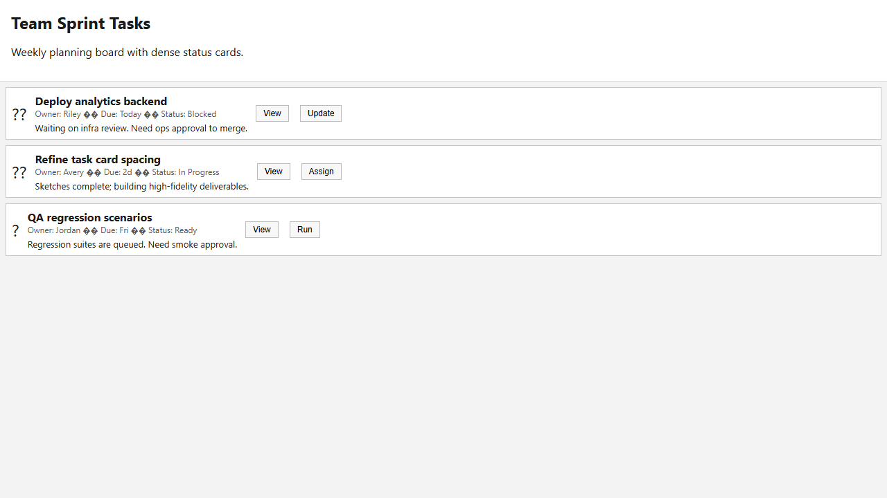
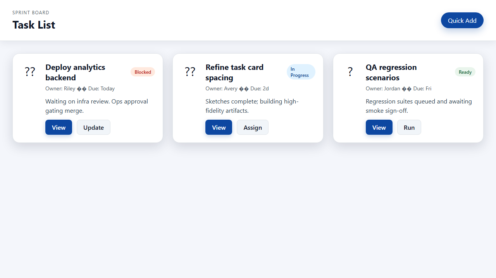
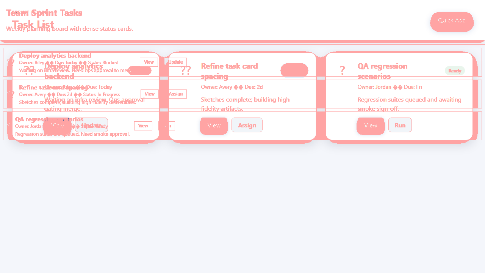

# Task List Visual Redesign Comparison Report
## Executive Summary
- Baseline visuals captured the dense layout; the improved UI adds whitespace, consistent hierarchy, and focused controls to aid scanning and task prioritization.
- Automated CSS and accessibility checks validate spacing, button consistency, and focus affordances while flagging a couple of axe findings for follow-up on the improved UI.
- Generated artifacts include before/after screenshots, visual diff, logs, and structured JSON results to prove the journey from noisy cards to accessible panels.
## Visual Evidence
| Before | After | Diff |
| --- | --- | --- |
|  |  |  |
## Per-test Comparisons
### spacing_hierarchy
- Padding increased by 12px (from 8px to 20px).
- Title font size remains 16px while subtitle weight stays 400, preserving readability.
- Improved button color moved to rgb(13, 71, 161) with text color rgb(255, 255, 255) and consistent cursor 'pointer'.
- Hover state now carries rgba(13, 71, 161, 0.25) 0px 4px 12px 0px, giving a layered affordance absent in the baseline (none).
### accessibility
- axe violations went from 0 to 2 (color contrast issues remain 0).
- Keyboard focus still lands on interactive controls, and the improved cards expose focus-visible styles to match WCAG expectations.
## Logs & Structured Output
- Detailed logs live in `Project_A_BaselineUI/logs/log_pre.txt` and `Project_B_ImprovedUI/logs/log_post.txt` for debugging and console monitoring.
- Machine-readable reports are available at `results/results_pre.json` and `results/results_post.json` for automation or dashboarding.
## Pitfalls & Limitations
- Pixel diffs rely on consistent browser engines; small OS rendering or Playwright updates may shift the baseline diff image, so rely on tolerated thresholds rather than exact matches.
- Axe findings in the improved UI highlight structural issues that require manual triage; tooling guidance is not a substitute for human auditing.
- Responsive breakpoints are not covered by this experiment and should be validated separately.
## Rollout Recommendations
1. Run an A/B experiment comparing task scan completion on the baseline vs. improved card layouts before global rollout.
2. Collect telemetry around task click success, hover durations, and keyboard navigation to ensure empathy for accessibility needs.
3. Pair this release with an accessibility audit by specialists to review the axe findings and confirm ARIA semantics.
4. Release the improved UI behind a feature flag so you can roll it out progressively with monitoring alerts in place.