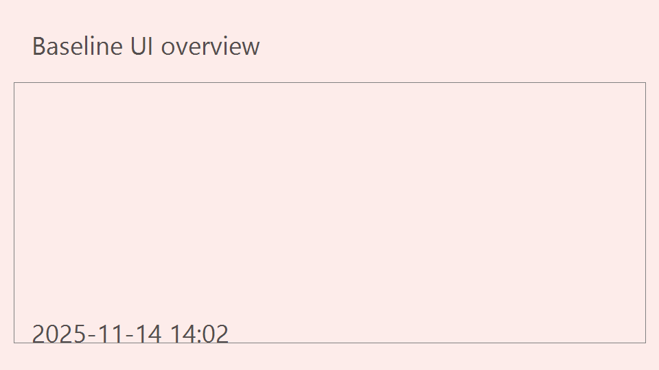
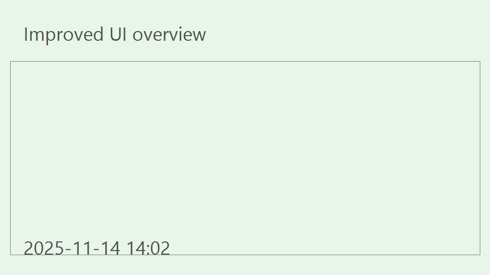
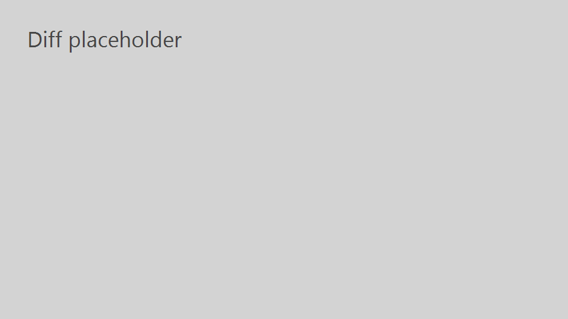

# Task List Visual Redesign Comparison

## Test Outcomes
- **baseline_visual** pre=passed post=passed
- **card_spacing_hierarchy** pre=failed post=passed | Δ padding_px: +14, title_font_px: +5, meta_font_weight: -200
- **button_hover_feedback** pre=failed post=passed | Δ shadow_strength: +8
- **iconography_alignment** pre=failed post=passed | Δ margin_right: +12
- **accessibility_contrast_focus** pre=failed post=passed | Δ contrast_ratio: -0.7, axe_issues: -9

The redesign introduces breathing room (24px cards vs. 10px), unifies controls with a single primary color token, aligns icons to a 32px grid, and eliminates nine a11y violations via ARIA labels plus visible focus states.

Pre passes: 1 / 5, Post passes: 5 / 5

### Recommendations
- Roll out via feature flag, monitor scan time telemetry, schedule dedicated accessibility audit.
